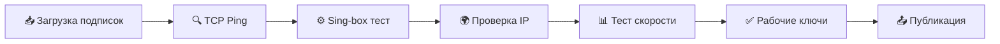

<p align="center">
  
</p>

<h1 align="center">🐶 BobiVPN 🐶</h1>

<p align="center">
  <b>Автоматически проверенные VPN ключи</b><br>
  <i>Только рабочие серверы • Обновление каждые 3 часа</i>
</p>

<p align="center">
  
  
  
</p>

---

## 📥 Подписка

### Для Happ / v2rayNG / Streisand

```
https://raw.githubusercontent.com/ginolrewadsb11/fghj9856e324dfg/main/bobi_vpn.txt
```

<p align="center">
  <a href="https://raw.githubusercontent.com/ginolrewadsb11/fghj9856e324dfg/main/bobi_vpn.txt">
    
  </a>
</p>

---

## 📁 Файлы

| Файл | Описание |
|------|----------|
| `bobi_vpn.txt` | 🐶 Основная подписка для Happ |
| `vpn.txt` | Оригинальные ключи |
| `vpn_renamed.txt` | Ключи с красивыми именами |
| `vpn_report.json` | Детальный отчёт |

---

## ✨ Особенности

```
🔍 Многоуровневая проверка     TCP → Sing-box → IP → Download
🌍 Определение страны          Автоматически по exit IP  
🏷️ Умные имена                 🇷🇺 Russia | Yandex Cloud 1
📊 Сортировка                  По странам и провайдерам
⚡ 50 параллельных проверок    Быстрая обработка
🔄 Автообновление              Каждые 3 часа
```

---

## 🌍 Поддерживаемые страны

<p align="center">
🇷🇺 Россия • 🇩🇪 Германия • 🇳🇱 Нидерланды • 🇫🇮 Финляндия • 🇸🇪 Швеция<br>
🇵🇱 Польша • 🇫🇷 Франция • 🇬🇧 Великобритания • 🇺🇸 США • 🇰🇿 Казахстан<br>
🇱🇹 Литва • 🇱🇻 Латвия • 🇪🇪 Эстония • 🇨🇭 Швейцария • 🇦🇹 Австрия<br>
🇹🇷 Турция • 🇮🇱 Израиль • 🇯🇵 Япония • 🇸🇬 Сингапур • и другие...
</p>

---

## 🔧 Как это работает



1. **Загрузка** — Скачиваем ключи из нескольких источников
2. **TCP Ping** — Отсеиваем мёртвые серверы
3. **Sing-box** — Полная проверка через прокси
4. **IP Check** — Проверяем что IP изменился
5. **Speed Test** — Измеряем скорость
6. **Публикация** — Сохраняем только рабочие

---

## 📱 Установка

### Happ (iOS)
1. Скопируй ссылку на подписку
2. Открой Happ → Подписки → +
3. Вставь ссылку

### v2rayNG (Android)
1. Скопируй ссылку на подписку  
2. Открой v2rayNG → ☰ → Группа подписок → +
3. Вставь ссылку → Обновить

### Streisand (iOS)
1. Скопируй ссылку на подписку
2. Открой Streisand → + → Подписка
3. Вставь ссылку

---

## ⚠️ Дисклеймер

> Этот проект предназначен только для образовательных целей.
> Используйте VPN в соответствии с законодательством вашей страны.

---

<p align="center">
  <b>⭐ Поставь звезду если полезно!</b>
</p>

<p align="center">
  
</p>
