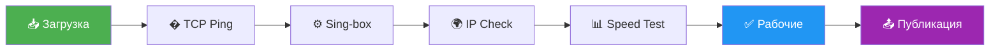

<p align="center">
  
</p>

<h1 align="center">🐶 BobiVPN 🐶</h1>

<p align="center">
  <b>Автоматически проверенные VPN ключи</b><br>
  <i>Только рабочие серверы • Обновление каждые 3 часа • Бесплатно</i>
</p>

<p align="center">
  
  
  
</p>

<p align="center">
  
  
  
  
</p>

---

## 📥 Подписка

<p align="center">
  <a href="happ://add/https://raw.githubusercontent.com/ginolrewadsb11/studious-umbrella/refs/heads/main/bobi_vpn.txt">
    
  </a>
  <a href="https://raw.githubusercontent.com/ginolrewadsb11/studious-umbrella/refs/heads/main/bobi_vpn.txt">
    
  </a>
</p>

```
https://raw.githubusercontent.com/ginolrewadsb11/studious-umbrella/refs/heads/main/bobi_vpn.txt
```

> [!TIP]
> Нажми на ссылку выше и скопируй её. Затем добавь в своё VPN приложение как подписку.

---

## 📱 Установка

<table>
<tr>
<td width="50%">

### 📱 Happ (iOS)


1. Скачай **Happ** из App Store
2. Открой приложение → Подписки → **+**
3. Вставь ссылку подписки
4. Нажми «Обновить»

<a href="https://apps.apple.com/app/happ-proxy-utility/id6504287215">
  
</a>

</td>
<td width="50%">

### 🤖 v2rayNG (Android)


1. Скачай **v2rayNG** из Google Play
2. Открой → ☰ → Группа подписок → **+**
3. Вставь ссылку подписки
4. Нажми «Обновить»

<a href="https://play.google.com/store/apps/details?id=com.v2ray.ang">
  
</a>

</td>
</tr>
<tr>
<td width="50%">

### 🦊 Hiddify (iOS / Android / Windows / macOS / Linux)


1. Скачай **Hiddify** для своей платформы
2. Открой → Добавить профиль → **Добавить из ссылки**
3. Вставь ссылку подписки
4. Выбери сервер и подключись

<a href="https://github.com/hiddify/hiddify-next/releases">
  
</a>

</td>
<td width="50%">

### 💻 Nekoray (Windows / Linux)


1. Скачай **Nekoray** с GitHub
2. Программа → Настройки подписки
3. Добавь ссылку подписки
4. Нажми «Обновить»ㅤㅤㅤㅤㅤㅤㅤㅤㅤㅤㅤㅤㅤㅤㅤㅤㅤㅤㅤㅤㅤㅤㅤㅤㅤㅤㅤㅤㅤㅤㅤㅤㅤㅤㅤㅤㅤㅤㅤㅤㅤㅤㅤㅤㅤㅤㅤㅤㅤㅤㅤㅤㅤㅤㅤㅤㅤㅤㅤㅤㅤ
<a href="https://github.com/MatsuriDayo/nekoray/releases">
  
</a>

</td>
</tr>
</table>

---

## ✨ Особенности

<table>
<tr>
<td align="center" valign="top" width="25%">
<br>
<b>Многоуровневая</b><br>
TCP → Sing-box<br>IP → Speed
</td>
<td align="center" valign="top" width="25%">
<br>
<b>Авто-определение</b><br>
Страна и провайдер
</td>
<td align="center" valign="top" width="25%">
<br>
<b>Красивые</b><br>
🇷🇺 Russia<br>Yandex Cloud 1
</td>
<td align="center" valign="top" width="25%">
<br>
<b>50 потоков</b><br>
Параллельная проверка
</td>
</tr>
</table>

---

## 🔧 Как это работает



| Этап | Описание |
|------|----------|
| **1. Загрузка** | Скачиваем ключи из нескольких источников |
| **2. TCP Ping** | Отсеиваем мёртвые серверы (таймаут 5 сек) |
| **3. Sing-box** | Полная проверка через локальный прокси |
| **4. IP Check** | Проверяем что exit IP изменился |
| **5. Speed Test** | Измеряем скорость загрузки |
| **6. Публикация** | Сохраняем только рабочие ключи |

---

## 🌍 География серверов

<p align="center">
🇷🇺 Россия • 🇩🇪 Германия • 🇳🇱 Нидерланды • 🇫🇮 Финляндия • 🇸🇪 Швеция<br>
🇵🇱 Польша • 🇫🇷 Франция • 🇬🇧 Великобритания • 🇺🇸 США • 🇰🇿 Казахстан<br>
🇱🇹 Литва • 🇱🇻 Латвия • 🇪🇪 Эстония • 🇨🇭 Швейцария • 🇦🇹 Австрия<br>
🇹🇷 Турция • 🇮🇱 Израиль • 🇯🇵 Япония • 🇸🇬 Сингапур • 🇭🇰 Гонконг
</p>

---

## 📁 Файлы подписок

| Файл | Формат | Описание |
|------|--------|----------|
| [`bobi_vpn.txt`](bobi_vpn.txt) | Happ | 🐶 Основная подписка с заголовком |
| [`vpn.txt`](vpn.txt) | Raw | Оригинальные ключи |
| [`vpn_renamed.txt`](vpn_renamed.txt) | Raw | Ключи с красивыми именами |
| [`vpn_report.json`](vpn_report.json) | JSON | Детальный отчёт с метаданными |

---

## 🛡️ Безопасность

> [!IMPORTANT]
> Все ключи проверяются автоматически каждые 3 часа. Нерабочие серверы удаляются, новые добавляются.

- ✅ Никаких логов
- ✅ Открытый исходный код
- ✅ Автоматическое обновление
- ✅ Проверка через Sing-box

---

## ⚠️ Дисклеймер

> [!CAUTION]
> Этот проект предназначен исключительно для образовательных целей.
> Используйте VPN в соответствии с законодательством вашей страны.
> Авторы не несут ответственности за использование данного проекта.

---

<p align="center">
  <b>⭐ Поставь звезду если полезно!</b>
</p>

<p align="center">
  <a href="https://github.com/ginolrewadsb11/studious-umbrella">
    
  </a>
  <a href="https://t.me/bobi_vpn">
    
  </a>
</p>

<p align="center">
  <sub>Made with ❤️ by BobiVPN Team</sub>
</p>
